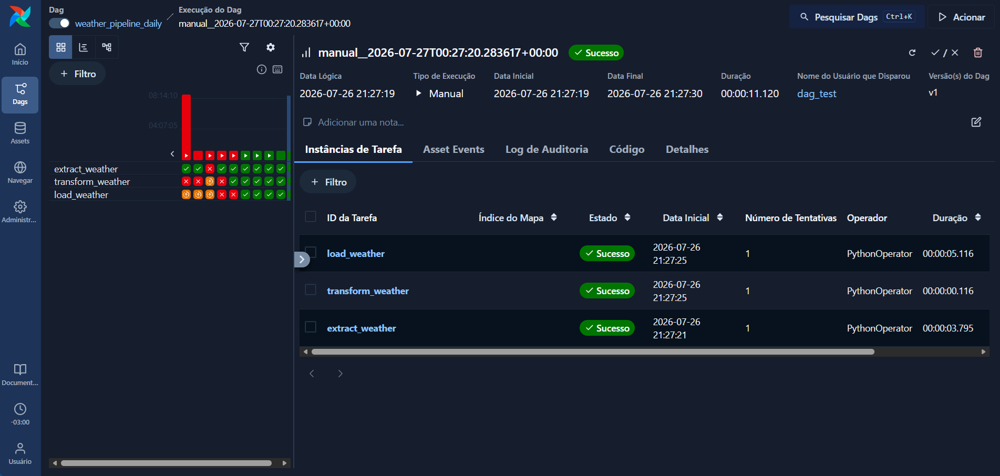

## Autor 
Graduando em Ciências de Dados, pela Uninter. 
Estagiário na iSystems. 

### [Linkedin](https://www.linkedin.com/in/jeduardosleite/) 
--- 

# Weather Pipeline com Apache Airflow

<p align="center">
  
</p>

## Sobre o projeto

Este projeto é uma evolução do **Pipeline Weather**, disponível neste mesmo repositório.

[Consultar a primeira etapa do projeto](../Pipeline_Weather)

O objetivo é desenvolver e orquestrar um pipeline de dados meteorológicos utilizando **Apache Airflow**, automatizando as etapas de extração, transformação, validação e carregamento dos dados.

Os dados são obtidos por meio da **Visual Crossing Weather API**, tratados com **Pandas** e armazenados em um banco **PostgreSQL hospedado no Supabase**.

Além do fluxo ETL, o pipeline possui uma rotina de **reconciliação de dados**, responsável por identificar automaticamente datas ausentes no banco e recuperar os períodos faltantes.

---

## Arquitetura do Projeto

```text
Pipeline_Weather_Airflow/
│
├── dags/
│   └── weather_dag.py
│
├── src/
│   ├── __init__.py
│   ├── config.py
│   ├── database.py
│   ├── extract.py
│   ├── transform.py
│   ├── load.py
│   └── quality.py
│
├── data/
│   ├── raw/
│   └── processed/
│
├── docs/
│
├── README.md
├── requirements.txt
├── .env.example
└── .gitignore
```

### Responsabilidade dos módulos

| Arquivo | Responsabilidade |
|---|---|
| `weather_dag.py` | Orquestração das tarefas com Apache Airflow |
| `config.py` | Configurações gerais do pipeline |
| `database.py` | Conexão com PostgreSQL |
| `extract.py` | Extração dos dados da API |
| `transform.py` | Tratamento e padronização dos dados |
| `load.py` | Carga dos dados no PostgreSQL |
| `quality.py` | Validação do período esperado e identificação de gaps |

---

# Fluxo do Pipeline

A DAG executa o seguinte fluxo:

```text
Check Missing Dates
        │
        ▼
Has Missing Dates?
        │
        ▼
     Extract
        │
        ▼
    Transform
        │
        ▼
      Load
```

Antes de iniciar o ETL, o pipeline verifica quais datas deveriam existir no banco.

O período esperado é:

```text
01/01 do ano atual → hoje + 7 dias
```

Caso existam lacunas, as datas faltantes são identificadas e agrupadas em intervalos consecutivos.

Por exemplo:

```text
Dados existentes:

01/08
02/08
13/08
14/08
```

O pipeline identifica:

```text
03/08 → 12/08
```

Somente o intervalo necessário é solicitado novamente à API.

Caso nenhuma data esteja faltando, a DAG pode encerrar o processamento sem realizar uma chamada desnecessária à API.

---

# Etapas do Pipeline

## 1. Data Quality

Antes da extração, o pipeline consulta o PostgreSQL e compara os registros existentes com o período esperado.

Responsabilidades:

- calcular o período esperado;
- consultar as datas existentes no banco;
- identificar datas ausentes;
- agrupar datas consecutivas em intervalos;
- evitar chamadas desnecessárias à API.

Essa etapa torna o pipeline capaz de realizar **reconciliação automática dos dados**.

---

## 2. Extract

Responsável por consumir a **Visual Crossing Weather API**.

Principais atividades:

- receber cidade e intervalo de datas;
- construir dinamicamente a URL da API;
- realizar a extração dos dados meteorológicos;
- armazenar os dados brutos na camada `raw`;
- registrar logs da execução.

Exemplo de intervalo solicitado:

```text
Florianopolis
2026-08-03 → 2026-08-12
```

---

## 3. Transform

Responsável pela preparação dos dados antes da carga.

Principais tratamentos:

- validação das colunas recebidas;
- seleção das colunas relevantes;
- padronização dos nomes;
- conversão de datas e horários;
- tratamento de valores nulos;
- normalização de textos;
- remoção de registros duplicados;
- inclusão da data de processamento;
- ordenação dos dados.

A combinação:

```text
cidade + data
```

é utilizada como chave de negócio para identificar cada registro meteorológico.

---

## 4. Load

Responsável pelo carregamento dos dados no PostgreSQL.

O processo utiliza uma tabela de **staging** antes da atualização da tabela final.

Fluxo:

```text
DataFrame
    │
    ▼
Staging Table
    │
    ▼
UPSERT
    │
    ▼
project_weather_daily
```

O PostgreSQL utiliza:

```sql
ON CONFLICT (cidade, data)
DO UPDATE
```

Com isso:

- novos registros são inseridos;
- registros existentes são atualizados;
- duplicidades são evitadas;
- reprocessamentos podem ser realizados com segurança.

---

# Tecnologias Utilizadas

## Linguagem e processamento

- Python
- Pandas
- SQLAlchemy
- psycopg2-binary
- python-dotenv
- Pendulum
- Logging
- pathlib

## Orquestração

- Apache Airflow
- DAG
- PythonOperator
- ShortCircuitOperator
- XCom

## Banco de Dados

- PostgreSQL
- Supabase

## API

- Visual Crossing Weather API

## Desenvolvimento

- Git
- GitHub
- Ubuntu Linux
- VS Code

---

# Como executar o projeto

## 1. Clonar o repositório

```bash
git clone https://github.com/jeduardosleite/Projects_Data_Engineer.git
```

---

## 2. Acessar o projeto

```bash
cd Projects_Data_Engineer/Pipeline_Weather_Airflow
```

---

## 3. Criar o ambiente virtual

```bash
python3 -m venv .venv
```

---

## 4. Ativar o ambiente virtual

### Linux

```bash
source .venv/bin/activate
```

### Windows PowerShell

```powershell
.venv\Scripts\Activate.ps1
```

---

## 5. Instalar as dependências

```bash
pip install -r requirements.txt
```

---

# Variáveis de Ambiente

Crie um arquivo `.env` baseado no `.env.example`.

```text
VC_API_KEY=

DB_HOST=
DB_PORT=
DB_NAME=
DB_USER=
DB_PASSWORD=
```

> O arquivo `.env` contém informações sensíveis e não deve ser versionado no Git.

---

# Configuração do Apache Airflow

## 1. Configurar o diretório das DAGs

Na raiz do projeto:

```bash
export AIRFLOW_HOME="$PWD/airflow"
export AIRFLOW__CORE__DAGS_FOLDER="$PWD/dags"
export AIRFLOW__CORE__LOAD_EXAMPLES=False
```

Para validar:

```bash
airflow config get-value core dags_folder
```

A saída esperada deve apontar para:

```text
<diretorio-do-projeto>/dags
```

---

## 2. Inicializar o banco interno do Airflow

```bash
airflow db migrate
```

---

## 3. Validar a DAG

Verifique possíveis erros de importação:

```bash
airflow dags list-import-errors --local
```

Resultado esperado:

```text
No data found
```

Liste a DAG:

```bash
airflow dags list --local | grep weather
```

A DAG esperada é:

```text
weather_pipeline_daily
```

---

## 4. Testar a DAG localmente

```bash
airflow dags test weather_pipeline_daily
```

Durante a execução, a DAG:

1. calcula o período esperado;
2. consulta as datas existentes no PostgreSQL;
3. identifica possíveis gaps;
4. agrupa períodos consecutivos;
5. extrai somente os dados necessários;
6. transforma os dados;
7. realiza o UPSERT no PostgreSQL.

---

# Interface Web do Airflow

## Iniciar o Scheduler

Abra um terminal, ative o ambiente virtual e configure o Airflow:

```bash
source .venv/bin/activate

export AIRFLOW_HOME="$PWD/airflow"
export AIRFLOW__CORE__DAGS_FOLDER="$PWD/dags"
export AIRFLOW__CORE__LOAD_EXAMPLES=False

airflow scheduler
```

Mantenha esse terminal aberto.

---

## Iniciar a interface Web

Em outro terminal:

```bash
source .venv/bin/activate

export AIRFLOW_HOME="$PWD/airflow"
export AIRFLOW__CORE__DAGS_FOLDER="$PWD/dags"
export AIRFLOW__CORE__LOAD_EXAMPLES=False

airflow api-server --port 8080
```

Depois, acesse:

```text
http://localhost:8080
```

---

# Validando a Qualidade dos Dados

Uma consulta SQL pode ser utilizada para verificar se existem datas faltantes entre o início do ano e os próximos sete dias:

```sql
SELECT d::date AS data_faltante
FROM generate_series(
    DATE_TRUNC('year', CURRENT_DATE)::date,
    CURRENT_DATE + INTERVAL '7 days',
    INTERVAL '1 day'
) AS d
LEFT JOIN project_weather_daily AS w
    ON w.data = d::date
    AND w.cidade = 'Florianopolis'
WHERE w.data IS NULL
ORDER BY d;
```

Se o pipeline estiver sincronizado, a consulta não deverá retornar datas ausentes.

---

# Principais Desafios

## Integração entre Airflow e módulos Python

Foi necessário estruturar o projeto de forma modular para permitir que as DAGs importassem corretamente os módulos de configuração, extração, transformação, qualidade e carga.

---

## Reconciliação de dados

Durante os testes foram identificadas lacunas no histórico armazenado no PostgreSQL.

Para resolver o problema, foi implementada uma etapa de qualidade que:

1. determina o período esperado;
2. consulta os registros existentes;
3. identifica as datas faltantes;
4. agrupa gaps consecutivos;
5. solicita novamente apenas os períodos necessários.

Com isso, o pipeline passou a ser capaz de **identificar e corrigir automaticamente lacunas nos dados**.

---

## UPSERT no PostgreSQL

A carga utiliza uma estratégia de UPSERT para garantir idempotência.

A combinação:

```text
cidade + data
```

identifica unicamente um registro.

Assim, executar novamente determinado período não deve gerar registros duplicados.

---

## Configuração do Airflow

Durante o desenvolvimento também foi necessário configurar corretamente:

- `AIRFLOW_HOME`;
- diretório das DAGs;
- banco interno do Airflow;
- Scheduler;
- API Server;
- importação dos módulos Python;
- validação e execução local das DAGs.

---

## Tratamento dos dados

Foram implementadas regras para:

- normalização de textos;
- conversão de datas e horários;
- tratamento de valores nulos;
- validação de colunas;
- eliminação de duplicidades;
- registro da data de carga.

---

# Aprendizados

O desenvolvimento deste projeto permitiu aplicar conceitos importantes de Engenharia de Dados, como:

- construção de pipelines ETL;
- orquestração com Apache Airflow;
- modularização de aplicações Python;
- integração com APIs;
- manipulação de dados com Pandas;
- integração com PostgreSQL;
- staging tables;
- UPSERT;
- idempotência;
- Data Quality;
- detecção de gaps;
- reconciliação de dados;
- logging;
- gerenciamento de variáveis de ambiente;
- versionamento com Git.
